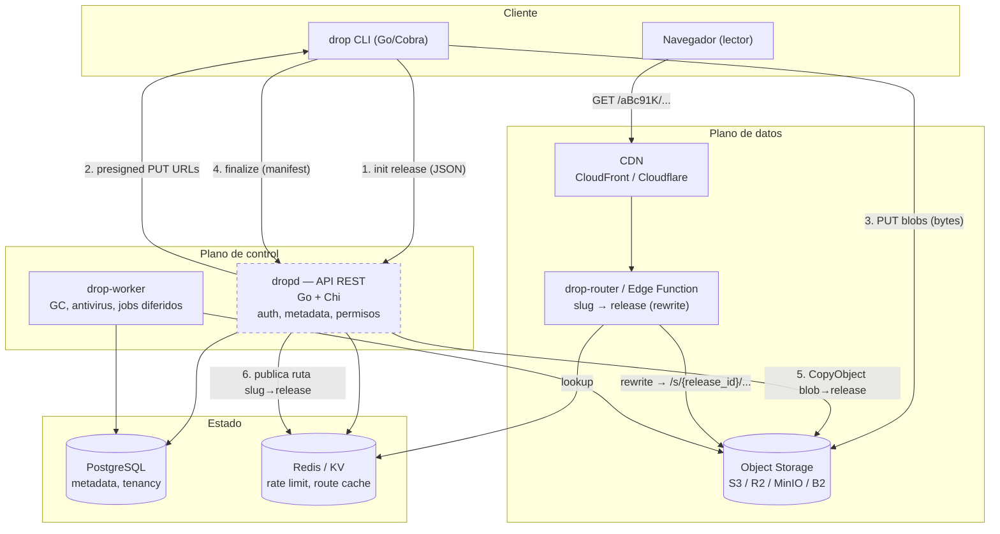
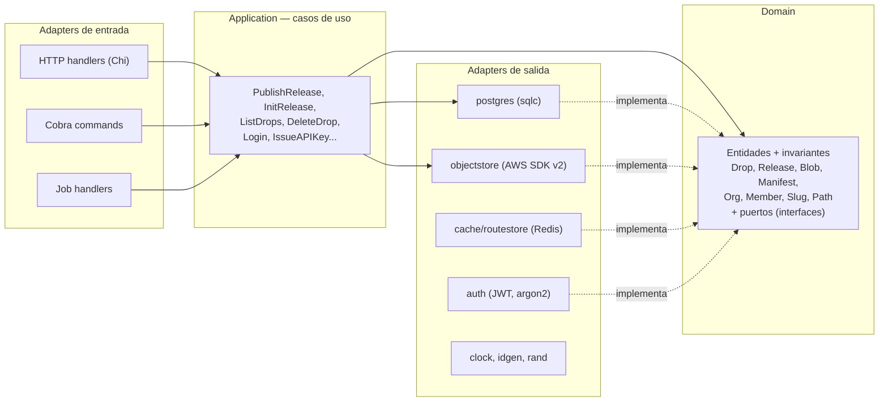
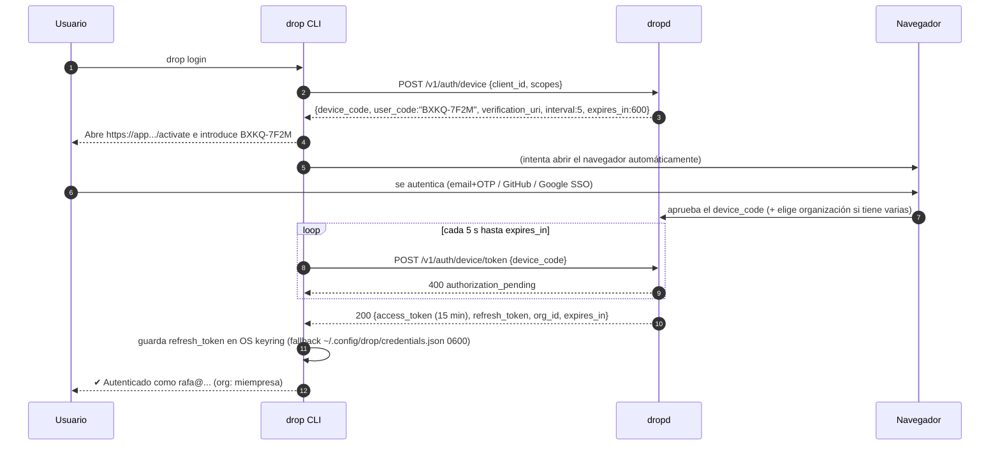

# 01 — Arquitectura, componentes y flujos

## 1. Visión general de la arquitectura

Drop es un sistema **de 4 componentes ejecutables** y 3 dependencias de
infraestructura. La propiedad más importante del diseño es la **separación entre el
plano de control y el plano de datos**:

- **Plano de control** (`dropd`, la API): autenticación, metadata, permisos,
  coordinación de la publicación. Maneja kilobytes de JSON. Escala horizontal,
  stateless.
- **Plano de datos** (Object Storage + CDN + `drop-router`): transporta y sirve los
  bytes reales. Nunca pasa por la API. Escala como escala S3/Cloudflare, es decir,
  no es nuestro problema.

El cliente (CLI) sube **directamente al object storage** con URLs prefirmadas, y el
lector descarga **directamente del CDN**. La API solo se entera de que ocurrió.



**La línea discontinua en la API es el invariante arquitectónico**: ningún byte de
contenido de usuario cruza `dropd`.

### Topología de despliegue (MVP → escala)

| Etapa | Despliegue |
|-------|-----------|
| MVP / dev | `docker-compose`: `dropd` (con worker embebido como goroutine), `drop-router`, Postgres, MinIO, Redis |
| v1 | `dropd` (N réplicas) + `drop-worker` (separado) + Postgres gestionado + R2/S3 + CDN real. Router se sustituye por Cloudflare Worker / CloudFront Function |
| v2 | Multi-región: `dropd` regional con Postgres primario + réplicas de lectura; *storage pools* por región; router edge global |

Es un **monolito modular desplegado en 2–3 binarios**, no microservicios. La
separación por *paquetes y puertos* (no por red) permite extraer un servicio más
tarde si un dominio lo justifica — hoy no lo justifica.

---

## 2. Componentes y 3. Responsabilidades

### 2.1 `drop` — CLI

Interfaz principal del producto. Debe sentirse como `git`.

**Responsabilidades**
- Autenticación (device flow + loopback), gestión de credenciales locales y perfiles.
- **Escaneo del proyecto**: recorrido del árbol, `.dropignore`, clasificación de
  tipos, detección del *entrypoint*.
- **Análisis de dependencias**: extracción transitiva de recursos referenciados desde
  HTML y CSS (modo archivo único).
- **Hashing** SHA-256 en streaming + tamaño + detección de MIME por magic bytes.
- Negociación de blobs faltantes con la API (**dedup del lado cliente**).
- Subida concurrente y reintentable directa al storage (multipart para archivos
  grandes).
- Renderizado de progreso (TTY) y salida `--json` (CI).

**No es responsable de**: decidir permisos, generar slugs, conocer el layout del
bucket, ni firmar peticiones a S3. Todo eso lo dicta la API. La CLI es un cliente
tonto con buena UX.

### 2.2 `dropd` — API REST

**Responsabilidades**
- Autenticación (JWT de acceso + refresh opaco + API keys) y autorización (RBAC por
  organización).
- CRUD de organizaciones, miembros, proyectos, drops, releases, dominios, API keys.
- **Orquestación de la publicación**: máquina de estados del release, emisión de URLs
  prefirmadas, verificación de integridad, ensamblado del release, *pointer flip*
  atómico.
- Generación de slugs y URLs públicas.
- Validación: MIME allowlist, límites de tamaño/cantidad, path traversal, cuotas.
- Rate limiting, auditoría, métricas, contadores de uso.
- Publicación de la tabla de rutas al `RouteStore` (Redis/KV) para el router.
- Sirve el contrato OpenAPI.

**No es responsable de**: servir, proxear, transformar ni inspeccionar el contenido
de los archivos (más allá de metadata declarada y verificada por checksum).

### 2.3 `drop-router` — Resolutor de rutas del plano de datos

El componente que hace posible casi todo el roadmap. Es **stateless y minúsculo**.

**Responsabilidades**
- Resolver `GET /{slug}/{path...}` → `s/{release_id}/{path...}`.
- Resolver el *entrypoint* y los índices de directorio (`/` → `index.html`).
- Aplicar `Cache-Control`, `X-Content-Type-Options`, `Referrer-Policy`,
  cabeceras de aislamiento.
- 404 propio cuando el slug no existe o el drop expiró.
- **Punto de extensión** para: contraseña (cookie firmada), expiración,
  dominios personalizados (`Host` → drop), analytics (log de eventos), rate limit
  por IP en lectura.

**Dos implementaciones tras un mismo puerto (`RouteResolver`)**
1. **MVP / self-hosted / dev**: servicio Go que hace *rewrite* y proxy del objeto
   desde el bucket (o `302` a la URL canónica inmutable, configurable). Funciona con
   MinIO y sin depender de ningún vendor.
2. **Producción cloud**: Cloudflare Worker + KV (o CloudFront Function +
   KeyValueStore) que hace el rewrite **en el borde, sin origen propio**: coste
   marginal ~0 y latencia ~0.

La API escribe el mapeo `slug → release_id` en el `RouteStore` como parte del
publish; el router solo lee.

> **Nota importante**: el router *sí* puede tocar bytes en modo proxy (dev/self-host).
> La regla "no servir archivos" aplica a `dropd`, que es donde vive la lógica de
> negocio y el acceso a Postgres. Mantenerlos separados es lo que permite que el
> plano de datos escale y falle de forma independiente.

### 2.4 `drop-worker` — Trabajos asíncronos

**Responsabilidades**
- **GC de blobs huérfanos** (no referenciados por ningún release, con periodo de
  gracia).
- Ensamblado de releases grandes (copias masivas) cuando exceden el umbral síncrono.
- Purga de releases borrados y de contenido tras retención.
- Antivirus opcional (ClamAV / escaneo externo) sobre blobs recién subidos.
- Agregación de contadores de uso y expiración de drops.
- Limpieza de `tmp/` y de uploads abandonados.

Implementación MVP: cola en Postgres (`SELECT ... FOR UPDATE SKIP LOCKED`) + cron
interno. Suficiente hasta cientos de miles de jobs/día y sin dependencias nuevas.
Puerto `JobQueue` para migrar a SQS/River/NATS si hace falta.

### 2.5 Dependencias de infraestructura

| Componente | Rol | Por qué |
|-----------|-----|---------|
| **PostgreSQL** | Fuente de verdad de metadata y tenancy | Transacciones (el *pointer flip* debe ser atómico), JSONB, particionado declarativo, `SKIP LOCKED` para colas |
| **Object Storage S3-compatible** | Bytes: CAS + releases servibles | Requisito explícito; presigned URLs y `CopyObject` server-side son el núcleo del diseño |
| **CDN** | Entrega, caché, TLS, dominios | El contenido es 100% estático e inmutable: caché cerca del 100% |
| **Redis / KV del edge** | Route cache, rate limiting, locks | Lecturas de ruta a p99 < 2 ms; degradable (fallback a Postgres) |

---

## 3.1 Vista lógica: capas y dependencias (Clean Architecture)



Reglas duras:
- `domain` **no importa nada** del proyecto ni librerías de infraestructura (ni
  `database/sql`, ni `aws-sdk`, ni `chi`). Solo stdlib.
- Los **puertos son interfaces pequeñas declaradas donde se consumen** (`usecase`),
  no un paquete `interfaces/` catch-all.
- El *wiring* es manual y explícito en `cmd/*` (sin framework de DI). Si el grafo
  duele, es señal de acoplamiento, no de que falte un framework.
- Nada de "3 capas por decreto": si un caso de uso es un CRUD de 10 líneas,
  el handler llama al repositorio a través del caso de uso y punto. No inventamos
  servicios de dominio vacíos.

---

## 4. Flujo completo de publicación

El flujo tiene 3 propiedades no negociables: **dedup** (no subir lo que ya existe),
**atomicidad** (nunca hay un drop medio publicado) e **integridad verificada por el
servidor** (el cliente no puede envenenar el CAS).

### 4.1 Máquina de estados del release

```
        init                finalize            assemble ok
draft ──────────► uploading ──────────► assembling ──────────► published
                     │                       │                      │
                     │ TTL expira            │ error/verify fail    │ nuevo release
                     ▼                       ▼                      ▼
                  expired                 failed              superseded
```

- Un `release` en cualquier estado ≠ `published` **es invisible** para el mundo.
- `drops.current_release_id` solo apunta a releases `published`.
- Publicar = `UPDATE drops SET current_release_id = $new` + escritura en el
  `RouteStore`. **Ese es el único instante de cambio visible.**

### 4.2 Secuencia detallada

```mermaid
sequenceDiagram
    autonumber
    participant U as Usuario
    participant CLI as drop CLI
    participant API as dropd
    participant PG as Postgres
    participant S3 as Object Storage
    participant KV as RouteStore
    participant CDN as CDN + router

    U->>CLI: drop upload .
    Note over CLI: FASE 1 — Análisis (local, sin red)
    CLI->>CLI: walk + .dropignore + allowlist de extensiones
    CLI->>CLI: sniff MIME (magic bytes) y valida contra extensión
    CLI->>CLI: sha256 + size en streaming (workers en paralelo)
    CLI->>CLI: detecta entrypoint (index.html | único .html)
    CLI->>CLI: construye Manifest{path, sha256, size, content_type}

    Note over CLI,API: FASE 2 — Negociación
    CLI->>API: POST /v1/drops/{slug}/releases  {entrypoint, files[]}
    API->>API: authz + cuotas + validación (paths, MIME, tamaños, nº archivos)
    API->>PG: crea drop (si es nuevo) + release(state=uploading) + release_files
    API->>PG: SELECT sha256 FROM blobs WHERE org_id=$1 AND sha256 = ANY($2)
    API->>S3: (opcional) HEAD para blobs dudosos
    API-->>CLI: 201 {release_id, uploads:[{sha256, url, headers}], skipped:[...]}
    Note right of API: presigned PUT con<br/>x-amz-checksum-sha256 y<br/>content-length-range firmados

    Note over CLI,S3: FASE 3 — Subida (bytes, sin pasar por la API)
    par hasta N=8 en paralelo
        CLI->>S3: PUT blobs/{org}/{aa}/{bb}/{sha256}
        S3-->>CLI: 200 (o 400 si el checksum no cuadra)
    end
    Note over CLI: reintentos con backoff+jitter;<br/>multipart para archivos > 8 MiB

    Note over CLI,KV: FASE 4 — Finalize (atómico)
    CLI->>API: POST /v1/releases/{id}/finalize  (Idempotency-Key)
    API->>S3: verifica existencia + tamaño + checksum de cada blob
    API->>PG: registra blobs nuevos (org_id, sha256, size, content_type)
    API->>S3: CopyObject blobs/... → s/{release_id}/{path}  (concurrente)
    Note right of S3: server-side copy:<br/>0 bytes de egreso,<br/>fija Content-Type y Cache-Control
    API->>PG: BEGIN; release.state=published; drops.current_release_id=$release; COMMIT
    API->>KV: SET route:{slug} = {release_id, visibility, expires_at}
    API-->>CLI: 200 {url, release_id, files, bytes, dedup_saved, duration}
    CLI-->>U: ✔ Listo — https://drop.miempresa.com/aBc91K

    Note over U,CDN: FASE 5 — Lectura
    U->>CDN: GET /aBc91K/
    CDN->>KV: lookup slug (cacheado)
    CDN->>S3: rewrite → s/{release_id}/index.html
    S3-->>CDN: 200 (Cache-Control: immutable)
    CDN-->>U: HTML completo
```

### 4.3 Detalles que hacen que esto funcione

**Integridad verificada por el storage, no por confianza.** La presigned PUT firma
`x-amz-checksum-sha256`. Si el cliente sube bytes distintos a los que declaró, **S3
rechaza el PUT** con 400. Sin esto, un cliente malicioso podría escribir contenido
arbitrario bajo el hash de otro archivo y envenenar el CAS. También se firma
`content-length-range` para que el límite de tamaño lo imponga el storage.

**Dedup con alcance por organización.** La tabla `blobs` tiene PK `(org_id, sha256)`.
Un dedup global ahorraría más espacio pero crea un **canal lateral**: subiendo un
archivo y observando si Drop lo omite, sabes si alguien más en la plataforma lo tiene.
Inaceptable en multi-tenant. El ahorro real (no re-subir en cada `upload` los mismos
assets del mismo equipo) se conserva íntegro.

**Copia server-side en lugar de resolver el manifest en el borde.** Tras subir al CAS,
`CopyObject` materializa los archivos en `s/{release_id}/{path}`. Esto permite que el
CDN sirva rutas reales sin ninguna lógica de manifest, con `Content-Type` y
`Cache-Control` correctos por objeto. El coste es almacenamiento duplicado (CAS +
release); es la decisión consciente de [ADR-003](04-decisiones-y-riesgos.md#adr-003).

**Umbral síncrono / asíncrono.** `finalize` copia en línea con `errgroup` limitado
mientras `file_count ≤ 200` y `total_bytes ≤ 100 MiB`. Por encima, encola un job y
devuelve `202 Accepted`; la CLI hace *polling* de `GET /v1/releases/{id}`. **El
contrato de la CLI es el mismo desde el día 1**, así que mover trabajo al worker más
tarde no rompe clientes.

**Idempotencia.** `finalize` acepta `Idempotency-Key`; reintentarlo sobre un release
ya `published` devuelve el mismo resultado, no un segundo release. La CLI reintenta
sin miedo ante timeouts.

**Fallo parcial.** Si `finalize` muere a mitad de las copias, el release queda en
`assembling`; los objetos de `s/{release_id}/` son basura inofensiva (nadie los
enruta) y el worker los limpia. El drop sigue sirviendo el release anterior. **No
existe estado visible corrupto.**

### 4.4 Republicar y primer publish

- `drop upload .` en un directorio con `.drop/config` ya vinculado → **nuevo release
  del mismo drop**: la URL no cambia, el contenido sí. Base del versionado (v1).
- Sin vínculo previo → crea drop nuevo, slug nuevo. `--new` fuerza drop nuevo.
- La invalidación es implícita: el path servido cambia (`release_id` nuevo), así que
  **nunca hay que purgar el CDN**. Solo expira la entrada de ruta (TTL 30–60 s, o
  escritura directa en KV para propagación inmediata).

---

## 5. Flujo de autenticación

Tres tipos de sujeto, un mismo modelo de autorización.

| Sujeto | Credencial | Uso |
|--------|-----------|-----|
| Humano en CLI | Refresh token opaco (keyring) → access JWT | `drop login` |
| Humano en navegador | Cookie de sesión (`Secure`, `HttpOnly`, `SameSite=Lax`) | Dashboard (v1) |
| Máquina / CI | API key `drop_sk_<id>_<secret>` | GitHub Actions, scripts |

### 5.1 `drop login` — Device Authorization Flow (primario)

Elegido como camino principal porque funciona en **SSH, contenedores, devcontainers y
CI interactivo**, donde abrir un navegador local no es opción. Si hay TTY con
navegador disponible, la CLI además intenta abrirlo automáticamente.



**Alternativa loopback + PKCE** (`drop login --browser`): la CLI levanta un listener
en `127.0.0.1:<puerto aleatorio>`, genera `code_verifier`/`code_challenge` (S256) y
recibe el código en el callback. Un poco más rápido en desktop; misma emisión de
tokens.

### 5.2 Tokens

- **Access token**: JWT firmado con **EdDSA (Ed25519)**, TTL 15 min, claims
  `sub, org, roles, scopes, jti, iat, exp, aud, iss`. Verificable sin tocar la base
  de datos → la API escala en horizontal sin estado de sesión. Claves rotables y
  publicadas en `GET /.well-known/jwks.json`.
- **Refresh token**: **opaco** (32 bytes de `crypto/rand`), almacenado como
  `sha256` en Postgres, TTL 30 días, **rotación en cada uso** con detección de reuso:
  si llega un refresh ya consumido, se revoca toda la *familia* (indicio de robo). Es
  la única credencial persistida en la máquina del usuario.
- **Revocación**: `jti` en denylist Redis para casos puntuales; TTL corto hace que la
  revocación completa sea barata sin lista global.

### 5.3 API keys (CI/CD)

Formato `drop_sk_<key_id>_<secret>`: el prefijo `key_id` permite **lookup O(1) por
índice** y el secreto se compara contra un hash **argon2id**. Alcances mínimos
(`releases:write`, `drops:read`), expiración opcional, `last_used_at`, revocación
inmediata. El prefijo `drop_sk_` es reconocible por los escáneres de secretos de
GitHub (registrable como *secret scanning partner* en v1).

### 5.4 Autorización

RBAC por organización, evaluado en el dominio (`authz.Can(subject, action, resource)`),
nunca disperso en los handlers:

| Rol | Permisos |
|-----|----------|
| `owner` | Todo + facturación + borrar la organización |
| `admin` | Gestionar miembros, dominios, API keys, todos los drops |
| `member` | Crear/publicar/borrar **sus** drops; leer los de la organización |
| `viewer` | Solo lectura de metadata |

Todo *scoping* de queries lleva `org_id` obligatorio a nivel de repositorio (y en v1,
RLS de Postgres como red de seguridad frente a un `WHERE` olvidado).

### 5.5 Autenticación del *lector* (v1, ya previsto)

Un drop `private` o con contraseña no lo resuelve la API sino el **router**:
1. El router ve `visibility != public` en la entrada de ruta.
2. Sin cookie válida → sirve un formulario mínimo / redirige a login.
3. Verificada la contraseña (argon2id, comparado vía API), emite una **cookie firmada
   con alcance al prefijo del release**.
4. En cloud: *signed cookies* de CloudFront/Cloudflare sobre `s/{release_id}/*` y
   bucket totalmente privado.

El diseño del MVP ya deja el bucket privado detrás del CDN con acceso de origen
(OAC / R2 custom domain) precisamente para no tener que rehacer esto.
