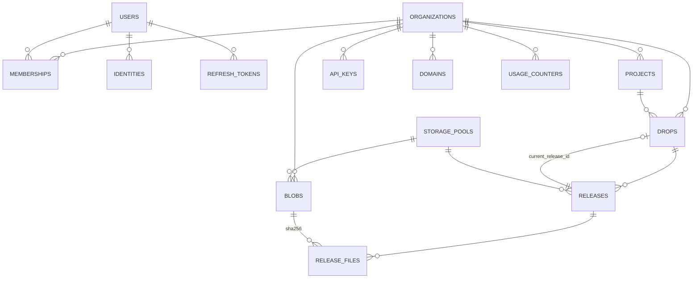

# 02 — Modelo de datos y almacenamiento

## 6. Modelo de datos

### 6.1 Diagrama de entidades



### 6.2 Decisiones transversales del esquema

| Decisión | Elección | Motivo |
|---|---|---|
| Claves primarias | **UUIDv7** (`uuid` nativo) | Ordenables temporalmente (localidad de índice como `bigserial`), generables en el cliente (la API conoce el ID antes de escribir → idempotencia y logs correlacionados), sin revelar volumen ni permitir enumeración |
| Timestamps | `timestamptz`, siempre UTC | Multi-región desde el día 1 |
| Borrado | **Soft delete** (`deleted_at`) + purga por worker | DMCA/GDPR requieren purga real, pero el borrado accidental necesita ventana de gracia (30 d) |
| Enums | `text` + `CHECK` | Añadir un valor a un `enum` de PG bloquea; con `CHECK` es un `ALTER` barato |
| Metadata extensible | `jsonb` en `meta` | Evita migraciones para atributos de producto; nunca para datos consultados en caliente |
| Multi-tenancy | `org_id` en **toda** tabla de negocio + RLS (v1) | Aislamiento defensivo: un `WHERE` olvidado no debe filtrar datos entre clientes |
| Migraciones | SQL versionado con **goose**, forward-only | Revisables, reproducibles; los rollbacks reales se hacen con migraciones compensatorias |

### 6.3 Esquema (DDL indicativo)

```sql
-- ─────────────── Identidad y tenancy ───────────────
CREATE TABLE organizations (
    id          uuid PRIMARY KEY,
    slug        text NOT NULL UNIQUE,              -- miempresa
    name        text NOT NULL,
    plan        text NOT NULL DEFAULT 'free',
    settings    jsonb NOT NULL DEFAULT '{}',
    created_at  timestamptz NOT NULL DEFAULT now(),
    updated_at  timestamptz NOT NULL DEFAULT now(),
    deleted_at  timestamptz
);

CREATE TABLE users (
    id            uuid PRIMARY KEY,
    email         citext NOT NULL UNIQUE,
    name          text,
    avatar_url    text,
    created_at    timestamptz NOT NULL DEFAULT now(),
    last_seen_at  timestamptz,
    deleted_at    timestamptz
);

-- SSO / OAuth desacoplado del usuario (GitHub, Google, SAML en v2)
CREATE TABLE identities (
    id           uuid PRIMARY KEY,
    user_id      uuid NOT NULL REFERENCES users(id),
    provider     text NOT NULL,                     -- github | google | email | saml
    provider_uid text NOT NULL,
    created_at   timestamptz NOT NULL DEFAULT now(),
    UNIQUE (provider, provider_uid)
);

CREATE TABLE memberships (
    org_id     uuid NOT NULL REFERENCES organizations(id),
    user_id    uuid NOT NULL REFERENCES users(id),
    role       text NOT NULL CHECK (role IN ('owner','admin','member','viewer')),
    created_at timestamptz NOT NULL DEFAULT now(),
    PRIMARY KEY (org_id, user_id)
);
CREATE INDEX ON memberships (user_id);

-- Contenedor lógico. En el MVP hay un 'default' por org y la CLI no lo expone.
-- Es la costura para Workspaces/Teams de v2 sin migrar drops.
CREATE TABLE projects (
    id         uuid PRIMARY KEY,
    org_id     uuid NOT NULL REFERENCES organizations(id),
    slug       text NOT NULL,
    name       text NOT NULL,
    created_at timestamptz NOT NULL DEFAULT now(),
    deleted_at timestamptz,
    UNIQUE (org_id, slug)
);

-- ─────────────── Publicación ───────────────
CREATE TABLE drops (
    id                 uuid PRIMARY KEY,
    org_id             uuid NOT NULL REFERENCES organizations(id),
    project_id         uuid NOT NULL REFERENCES projects(id),
    slug               text NOT NULL UNIQUE,        -- aBc91K  (global, es la URL)
    title              text NOT NULL DEFAULT '',
    current_release_id uuid,                        -- FK diferida a releases
    visibility         text NOT NULL DEFAULT 'public'
                       CHECK (visibility IN ('public','unlisted','private')),
    password_hash      text,                        -- v1
    expires_at         timestamptz,                 -- v1
    created_by         uuid NOT NULL REFERENCES users(id),
    meta               jsonb NOT NULL DEFAULT '{}',
    created_at         timestamptz NOT NULL DEFAULT now(),
    updated_at         timestamptz NOT NULL DEFAULT now(),
    deleted_at         timestamptz
);
CREATE INDEX ON drops (org_id, created_at DESC) WHERE deleted_at IS NULL;
CREATE INDEX ON drops (project_id, created_at DESC) WHERE deleted_at IS NULL;
CREATE INDEX ON drops (expires_at) WHERE expires_at IS NOT NULL AND deleted_at IS NULL;

CREATE TABLE releases (
    id           uuid PRIMARY KEY,
    drop_id      uuid NOT NULL REFERENCES drops(id),
    org_id       uuid NOT NULL,                     -- desnormalizado: cuotas y GC sin join
    seq          integer NOT NULL,                  -- 1, 2, 3... por drop
    state        text NOT NULL CHECK (state IN
                 ('uploading','assembling','published','superseded','failed','expired')),
    entrypoint   text NOT NULL DEFAULT 'index.html',
    file_count   integer NOT NULL DEFAULT 0,
    total_bytes  bigint  NOT NULL DEFAULT 0,
    pool_id      uuid NOT NULL REFERENCES storage_pools(id),
    source       text NOT NULL DEFAULT 'cli' CHECK (source IN ('cli','api','github','sdk')),
    client_info  jsonb NOT NULL DEFAULT '{}',       -- versión de CLI, OS
    created_by   uuid REFERENCES users(id),
    api_key_id   uuid REFERENCES api_keys(id),
    created_at   timestamptz NOT NULL DEFAULT now(),
    published_at timestamptz,
    UNIQUE (drop_id, seq)
);
CREATE INDEX ON releases (drop_id, seq DESC);
CREATE INDEX ON releases (state, created_at) WHERE state IN ('uploading','assembling');
ALTER TABLE drops ADD CONSTRAINT drops_current_release_fk
    FOREIGN KEY (current_release_id) REFERENCES releases(id);

-- Content-addressable store. PK con org_id = dedup con alcance de tenant (ver ADR-012).
CREATE TABLE blobs (
    org_id       uuid NOT NULL REFERENCES organizations(id),
    sha256       bytea NOT NULL,                    -- 32 bytes, no hex: mitad de espacio
    size         bigint NOT NULL,
    content_type text NOT NULL,
    pool_id      uuid NOT NULL REFERENCES storage_pools(id),
    storage_key  text NOT NULL,
    scan_state   text NOT NULL DEFAULT 'skipped'
                 CHECK (scan_state IN ('skipped','pending','clean','infected')),
    created_at   timestamptz NOT NULL DEFAULT now(),
    PRIMARY KEY (org_id, sha256)
);
CREATE INDEX ON blobs (created_at) ;                 -- ventana de gracia del GC

-- Tabla más grande del sistema: N_releases × N_archivos.
-- Particionada por hash del release_id: todas las queries llevan release_id.
CREATE TABLE release_files (
    release_id   uuid NOT NULL,
    path         text NOT NULL,                     -- normalizado, relativo: 'assets/app.css'
    sha256       bytea NOT NULL,
    size         bigint NOT NULL,
    content_type text NOT NULL,
    PRIMARY KEY (release_id, path)
) PARTITION BY HASH (release_id);
-- 32 particiones iniciales; repartir es un DDL online con pg_partman más adelante.
CREATE INDEX ON release_files (sha256);              -- GC: ¿queda alguna referencia?

-- ─────────────── Storage federado ───────────────
-- Permite múltiples buckets, providers y regiones sin tocar el código.
CREATE TABLE storage_pools (
    id              uuid PRIMARY KEY,
    name            text NOT NULL UNIQUE,           -- 'r2-eu-primary'
    provider        text NOT NULL,                  -- s3 | r2 | minio | b2
    region          text NOT NULL,
    endpoint        text,                           -- vacío = AWS por defecto
    bucket          text NOT NULL,
    public_base_url text NOT NULL,                  -- https://drop.miempresa.com
    writable        boolean NOT NULL DEFAULT true,  -- false = solo lectura (drenaje)
    weight          integer NOT NULL DEFAULT 100,   -- reparto de escrituras nuevas
    created_at      timestamptz NOT NULL DEFAULT now()
);
-- Una org se "pega" a un pool (organizations.settings->>'default_pool_id') para que
-- el dedup funcione: dos blobs iguales deben caer en el mismo bucket.

-- ─────────────── Credenciales y auditoría ───────────────
CREATE TABLE api_keys (
    id          uuid PRIMARY KEY,
    org_id      uuid NOT NULL REFERENCES organizations(id),
    name        text NOT NULL,
    key_id      text NOT NULL UNIQUE,               -- parte pública, lookup O(1)
    secret_hash text NOT NULL,                      -- argon2id
    scopes      text[] NOT NULL,
    created_by  uuid NOT NULL REFERENCES users(id),
    expires_at  timestamptz,
    last_used_at timestamptz,
    revoked_at  timestamptz,
    created_at  timestamptz NOT NULL DEFAULT now()
);

CREATE TABLE refresh_tokens (
    id          uuid PRIMARY KEY,
    user_id     uuid NOT NULL REFERENCES users(id),
    family_id   uuid NOT NULL,                      -- revocación en cascada ante reuso
    token_hash  bytea NOT NULL UNIQUE,
    org_id      uuid REFERENCES organizations(id),
    user_agent  text,
    expires_at  timestamptz NOT NULL,
    revoked_at  timestamptz,
    replaced_by uuid REFERENCES refresh_tokens(id),
    created_at  timestamptz NOT NULL DEFAULT now()
);
CREATE INDEX ON refresh_tokens (user_id, expires_at);

CREATE TABLE domains (                              -- v1: dominios personalizados
    id          uuid PRIMARY KEY,
    org_id      uuid NOT NULL REFERENCES organizations(id),
    drop_id     uuid REFERENCES drops(id),          -- NULL = dominio de toda la org
    hostname    text NOT NULL UNIQUE,
    verify_token text NOT NULL,
    verified_at timestamptz,
    cert_state  text NOT NULL DEFAULT 'pending',
    created_at  timestamptz NOT NULL DEFAULT now()
);

CREATE TABLE audit_events (
    id          uuid NOT NULL,
    org_id      uuid NOT NULL,
    actor_type  text NOT NULL,                      -- user | api_key | system
    actor_id    uuid,
    action      text NOT NULL,                      -- drop.published, api_key.revoked
    target_type text,
    target_id   uuid,
    ip          inet,
    user_agent  text,
    meta        jsonb NOT NULL DEFAULT '{}',
    created_at  timestamptz NOT NULL DEFAULT now(),
    PRIMARY KEY (id, created_at)
) PARTITION BY RANGE (created_at);                   -- particiones mensuales, drop barato

CREATE TABLE usage_counters (                        -- cuotas y facturación (v1)
    org_id        uuid NOT NULL REFERENCES organizations(id),
    period        date NOT NULL,                     -- primer día del mes
    bytes_stored  bigint NOT NULL DEFAULT 0,
    bytes_egress  bigint NOT NULL DEFAULT 0,
    publishes     integer NOT NULL DEFAULT 0,
    PRIMARY KEY (org_id, period)
);

CREATE TABLE jobs (                                  -- cola: SKIP LOCKED
    id           uuid PRIMARY KEY,
    kind         text NOT NULL,
    payload      jsonb NOT NULL,
    run_after    timestamptz NOT NULL DEFAULT now(),
    attempts     integer NOT NULL DEFAULT 0,
    max_attempts integer NOT NULL DEFAULT 10,
    locked_at    timestamptz,
    locked_by    text,
    last_error   text,
    created_at   timestamptz NOT NULL DEFAULT now()
);
CREATE INDEX ON jobs (run_after) WHERE locked_at IS NULL;
```

### 6.4 Generación de slugs

- Alfabeto **base62** (`0-9A-Za-z`), **8 caracteres** → 2,18 × 10¹⁴ combinaciones.
  Con 10⁹ drops publicados, la probabilidad de acertar uno al azar es ~5 × 10⁻⁶: la
  enumeración es inviable incluso sin rate limiting (que aun así existe).
- Generación con `crypto/rand`, no secuencial ni derivada del contenido (un slug
  predecible filtra información).
- Colisión → índice único + reintento (máx. 5). A escala de 10⁹ la probabilidad por
  inserción es < 10⁻⁵.
- **Blocklist** de slugs reservados (`api`, `admin`, `login`, `assets`, `_`, `s`,
  `health`, `.well-known`…) y filtro de secuencias ofensivas.
- ⚠️ **Caveat DNS**: base62 es *case-sensitive*, los hostnames no. Si en v1 se adopta
  aislamiento por subdominio (`aBc91K.dropusercontent.com`), se guarda además un
  `host_token` en minúsculas (base36, 10 chars) derivado en el momento de la creación.
  Alternativa si se prefiere una sola representación: base36 de 10 caracteres desde el
  inicio, sacrificando 2 caracteres de longitud. **Recomendación: base62 de 8 ahora,
  `host_token` cuando se necesite.**
- Slugs personalizados (`--slug mi-arquitectura`) en v1, con verificación de
  propiedad a nivel de organización.

### 6.5 Escala: qué pasa con millones de publicaciones

| Tabla | Filas a 10⁷ drops | Estrategia |
|---|---|---|
| `drops` | 10⁷ | Índices parciales, sin particionar (10⁷ filas es rutina en PG) |
| `releases` | ~3 × 10⁷ (3 releases/drop) | Sin particionar en v1; `PARTITION BY HASH (drop_id)` disponible |
| `release_files` | ~6 × 10⁸ (20 archivos/release) | **Ya particionada** por hash (32 → 256 particiones). Todas las lecturas llevan `release_id` ⇒ *partition pruning* perfecto |
| `blobs` | ~2 × 10⁸ | PK `(org_id, sha256)`: distribución natural. Particionable por hash de `org_id` |
| `audit_events` | Crece sin límite | Particiones mensuales por rango + retención 12 meses (`DROP PARTITION` es instantáneo) |

Lo que **no** se hace nunca: `COUNT(*)` sin filtro, `OFFSET` para paginar (se usan
cursores `(created_at, id)`), ni `ORDER BY` sobre columnas sin índice. La paginación
por cursor es parte del contrato de la API desde el MVP.

---

## 7. Diseño del almacenamiento

### 7.1 Modelo de dos niveles

```
┌─────────────────────────────┐        ┌─────────────────────────────┐
│  Nivel 1: CAS (privado)     │        │  Nivel 2: Releases (CDN)    │
│  blobs/{org}/{aa}/{bb}/{h}  │  copy  │  s/{release_id}/{path}      │
│                             │ ─────► │                             │
│  · direccionado por hash    │ server │  · direccionado por ruta    │
│  · dedup por organización   │  side  │  · inmutable                │
│  · nunca público            │        │  · Content-Type real        │
│  · nunca sobrescrito*       │        │  · max-age=1y, immutable    │
└─────────────────────────────┘        └─────────────────────────────┘
```

\* Escribir el mismo hash dos veces es idempotente por definición: mismos bytes.

**Por qué dos niveles.** Un solo nivel obliga a elegir entre dedup (CAS: los assets
compartidos se suben una vez) y servir contenido estático sin compute (rutas reales:
el CDN pide `/aBc91K/assets/app.css` y el bucket lo tiene). Con dos niveles se
obtienen ambos: **el dedup ahorra red y tiempo en el `upload`** (el requisito real:
"calcular hashes para evitar subir archivos duplicados") y **la copia server-side
—0 bytes de egreso, ~10 ms por objeto— materializa las rutas** que el CDN necesita.

### 7.2 Layout del bucket

```
s3://drop-content-prod-eu/
│
├── blobs/                                  # CAS — PRIVADO, sin acceso desde CDN
│   └── {org_short}/                        #   primeros 8 chars del uuid de org
│       └── {aa}/{bb}/                      #   sha256[0:2]/sha256[2:4] → sharding
│           └── {sha256_hex}                #   sin extensión: los bytes no la tienen
│
├── s/                                      # RELEASES — servido por el CDN
│   └── {release_id}/                       #   uuidv7 → prefijos ordenados y dispersos
│       ├── index.html
│       ├── assets/app.css
│       └── img/diagram.svg
│
├── tmp/                                    # staging de multipart y uploads huérfanos
│   └── {upload_id}/...                     #   lifecycle: abort/delete a 24 h
│
└── _sys/                                   # 404.html, error pages, favicon del router
```

**Sharding de prefijos.** S3 particiona internamente por prefijo; concentrar
escrituras bajo un prefijo secuencial provoca *throttling* (503 SlowDown). Los dos
niveles `{aa}/{bb}` del hash dan 65 536 prefijos con distribución uniforme perfecta.
Para `s/`, UUIDv7 tiene el timestamp al principio (bueno para listar, malo para
distribuir): si a gran escala aparece *throttling*, el mitigante es prefijar con 2
caracteres del hash del release_id — **queda documentado pero no se implementa en el
MVP** (S3 hoy autoescala prefijos y R2 no tiene el problema).

### 7.3 Cabeceras y metadata por objeto

En el `CopyObject` hacia `s/` se fijan:

| Cabecera | Valor | Por qué |
|---|---|---|
| `Content-Type` | Del manifest, validado contra allowlist | Nunca inferido por el CDN |
| `Cache-Control` | `public, max-age=31536000, immutable` | La ruta contiene `release_id`: es inmutable por construcción. Cero invalidaciones |
| `Content-Disposition` | `inline` | Que se renderice, no que se descargue |
| `X-Content-Type-Options` | `nosniff` (vía CDN/response headers policy) | Impide que el navegador reinterprete un `.txt` como HTML |
| `x-amz-meta-drop-sha256` | hash | Trazabilidad y verificación posterior |
| `x-amz-meta-drop-release` | release_id | Auditoría y GC |

Compresión: el CDN comprime al vuelo (`gzip`/`brotli`) según `Accept-Encoding`. No
almacenamos variantes pre-comprimidas en el MVP (duplicaría objetos y complicaría el
CAS); si el ahorro lo justifica, se añade brotli precomputado para `text/*` en v2.

### 7.4 Allowlist de tipos

Se valida **en el cliente** (feedback rápido), **en la API** (autoridad) y el tamaño
lo impone **el storage** (condición firmada en la presigned URL). Defensa en
profundidad: coincidencia de extensión ↔ magic bytes ↔ `Content-Type` declarado.

| Categoría | Extensiones | Content-Type servido |
|---|---|---|
| Documento | `.html .htm` | `text/html; charset=utf-8` |
| Estilos | `.css` | `text/css; charset=utf-8` |
| Script | `.js .mjs` | `text/javascript; charset=utf-8` |
| Datos | `.json .csv .txt .md .xml .yml .yaml` | `application/json`, `text/plain`… |
| Imagen | `.png .jpg .jpeg .gif .webp .avif .ico .bmp` | `image/*` |
| Vector | `.svg` | `image/svg+xml` (⚠️ ver riesgo R-02) |
| Fuente | `.woff .woff2 .ttf .otf` | `font/*` |
| Vídeo/audio | `.mp4 .webm .mp3 .ogg .wav` | `video/*`, `audio/*` |
| WASM | `.wasm` | `application/wasm` |
| Mapas | `.map` | `application/json` |

**Bloqueado siempre**: ejecutables (`.exe .dll .so .dylib .bin .sh .bat .ps1`),
archivos (`.zip .tar .gz .7z .rar` — Drop no es un file host), `.php .jsp .asp`
(señal de intento de ejecución), y todo lo que no esté en la lista. Extensión
desconocida → error explicativo, no `application/octet-stream` silencioso.

### 7.5 Límites (configurables por plan)

| Límite | MVP (free) | Motivo |
|---|---|---|
| Tamaño por archivo | 25 MiB (100 MiB vídeo) | Drop no es un CDN de vídeo |
| Tamaño por release | 250 MiB | Contención de abuso |
| Archivos por release | 2 000 | Protege el `finalize` y `release_files` |
| Profundidad de rutas | 20 niveles / 255 chars por segmento | Compatibilidad y sanidad |
| Publicaciones | 100/día por organización | Rate limit de abuso |
| Almacenamiento | 5 GiB por organización | Cuota de plan |

### 7.6 Ciclo de vida y recolección de basura

```
Publicar release N+1 → release N pasa a 'superseded'
                     → sus objetos en s/{release_N}/ se CONSERVAN
                       (rollback instantáneo en v1 = mover el puntero)
                     → retención: 10 últimos releases o 90 días
```

**GC de blobs huérfanos** (job periódico, no *refcounting*):

```sql
-- Candidatos: blobs sin ninguna referencia y fuera de la ventana de gracia.
SELECT org_id, sha256 FROM blobs b
WHERE b.created_at < now() - interval '7 days'
  AND NOT EXISTS (SELECT 1 FROM release_files rf WHERE rf.sha256 = b.sha256)
LIMIT 1000;
```

Se descarta el `refcount` en columna a propósito: sería una **fila caliente** con
contención en cada publish concurrente y un contador que, si se desincroniza, borra
datos vivos. Un barrido periódico es más lento y **mucho más seguro**; la ventana de
gracia de 7 días protege de la carrera "blob subido, release aún sin finalizar".
El borrado es en dos fases: marcar → verificar de nuevo → `DeleteObjects` en lotes de
1 000.

**Reglas de lifecycle del bucket**
- `tmp/*`: `AbortIncompleteMultipartUpload` a 1 día + expiración a 1 día.
- `s/*` de releases purgados: borrado explícito por el worker (no por lifecycle: hay
  que ser exactos).
- Sin versionado de bucket: la inmutabilidad ya está en el diseño de claves y el
  versionado duplicaría coste y complicaría el GC.

### 7.7 Multi-bucket, multi-región

`storage_pools` es la abstracción. Cada `release` y cada `blob` guardan su `pool_id`,
así que **el sistema nunca asume un único bucket**:

- **Añadir capacidad**: insertar un pool con `weight > 0`. Las escrituras nuevas se
  reparten; las lecturas van al pool registrado en la fila. Cero migración.
- **Drenar un bucket**: `writable = false`. Deja de recibir escrituras y sigue
  sirviendo.
- **Multi-región (v2)**: pool por región + `default_pool_id` por organización (se
  elige el más cercano al equipo). Una organización queda *pegada* a su pool porque
  el dedup requiere que blobs idénticos compartan bucket. Réplica cruzada opcional
  para lecturas globales; el CDN ya resuelve el 99% de la latencia.
- **Cambiar de proveedor**: pool nuevo en R2, viejo en solo lectura, worker de
  re-hospedaje en background. Sin downtime, sin cambios de URL.

### 7.8 Diseño del CDN

```
Cliente → CDN (drop.miempresa.com)
            ├── /{slug}/*        → router (rewrite) → origen S3 /s/{release_id}/*
            ├── /_sys/*          → origen S3 (páginas de error)
            └── todo lo demás    → 404 del router
```

- **Bucket privado** con acceso de origen (CloudFront OAC / R2 custom domain / política
  de bucket restringida al CDN). Nunca `public-read`: el día que existan drops
  privados, la URL directa al objeto no debe funcionar.
- TTL de la resolución `slug → release`: 30–60 s con `stale-while-revalidate`; la API
  escribe en KV al publicar para propagación casi inmediata.
- Los objetos son inmutables → **hit ratio esperado > 95%** y coste de origen mínimo.
- `Host` header como discriminador para dominios personalizados (v1) sin tocar rutas.
